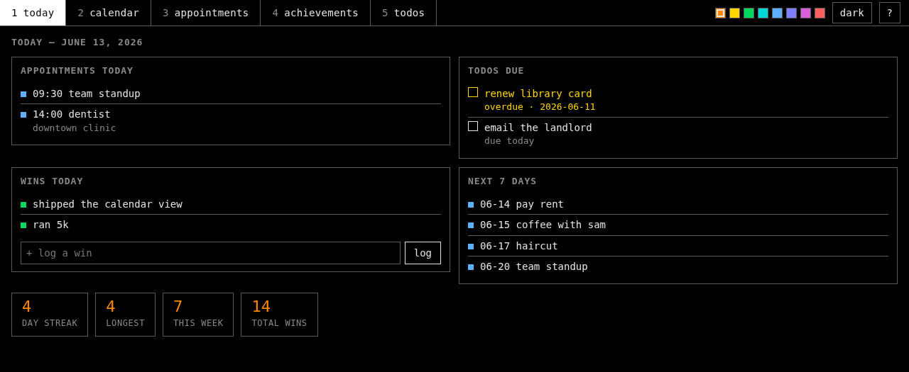
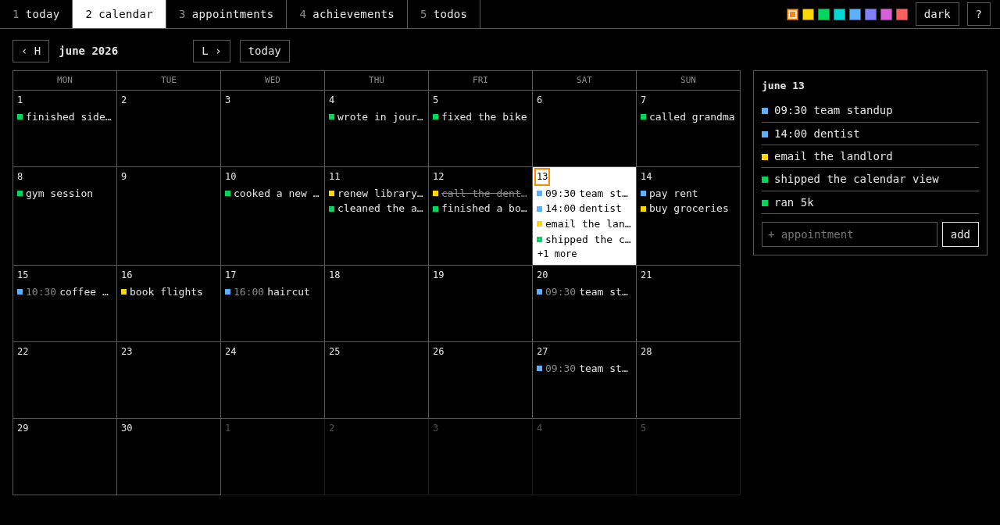

# lifeplanner

a local, private life dashboard — **calendar · appointments · achievements · todos** — with a
twist: an llm can read and write it too. one set of plain json files on your disk, two doors into
them: a fast vanilla web ui for you, and an [mcp](https://modelcontextprotocol.io) server for an
assistant like claude. no accounts, no cloud, no tracking. your data never leaves your machine.





- **stdlib-only web app** — python 3.8+, no dependencies. clone and run.
- **square, terminal-styled ui** — light + dark, eight accent colors, keyboard-first (vim keys).
- **read-only `.ics` feed** — subscribe from your phone, see appointments + due todos there.
- **mcp server** — let an assistant log your wins, add todos, and review your day (one optional dep).
- **bulletproof storage** — atomic writes, cross-process lock, corrupt-file-safe. tested.

## quick start

```sh
git clone https://github.com/mellen9999/lifeplanner.git && cd lifeplanner
./launch.sh            # or: python3 app.pyw
```

opens `http://127.0.0.1:8765`. bound to localhost only — nothing is exposed to your network.
launching again just focuses the running window (only one server runs at a time).

no build step, no `npm`, no dependencies for the app itself.

## how to use it

five sections (number keys switch them):

1. **today** — your daily glance. appointments today, todos due/overdue, today's wins with a
   one-field win logger, the next 7 days, and a streak ribbon. open this first each day.
2. **calendar** — month grid; click a day to see/add what's on it. colored marks: green = a win,
   blue = an appointment, yellow = a due todo.
3. **appointments** — things at a time. add with a date (+ optional time) and place. set
   **repeat** (daily / weekly / every-other-week / monthly) to make it recur — the list shows the
   next occurrence, the calendar marks every one, and your phone gets it as a standard repeating event.
4. **achievements** — your wins log, with a contribution heatmap + streak counters. log small wins
   often; watching the streak grow is the point.
5. **todos** — things to do; give one a due date and it becomes a reminder on the calendar + phone.

every item can be edited in place (`e` or double-click) or deleted (`×` / `d d`). nothing needs
saving — it's written to disk the moment you add it.

## keys

| keys | action | | keys | action |
|---|---|---|---|---|
| `1` … `5` | switch section | | `h` `j` `k` `l` | calendar: move day in grid |
| `n` | new item | | `H` / `L` | calendar: jump month |
| `j` / `k` | move selection (lists) | | `e` / dbl-click | edit selected |
| `x` | toggle todo done | | `enter` | save edit / open day |
| `d` `d` | delete selected | | `t` · `r` · `?` | theme · refresh · help |

theme and accent are saved with your data.

## let an assistant in (optional mcp)

```sh
./install.sh           # linux/mac — or install.bat on windows
```

it creates `.venv`, installs the mcp sdk, and prints a ready `claude mcp add …` line (the windows
script prints the `\.venv\Scripts\python.exe` path). run it, restart claude, and check `/mcp`. the assistant
then has these tools, all writing to the same local files the web app reads:

read: `get_overview` · `get_day` · `get_week` · `list_achievements` · `list_todos` ·
`list_appointments`
write: `add_achievement` · `add_todo` · `complete_todo` · `add_appointment` ·
`update_achievement` · `update_todo` · `update_appointment` · `delete_item`

writes from the assistant appear in your open ui within a few seconds; your edits are visible to it
immediately. (works with any mcp client — claude desktop, claude code, etc.)

## use it from your phone

the simplest, most robust way — no second calendar, nothing to sync: run lifeplanner on
a machine that's reachable, and open it in your phone's browser over your **private
network** (a LAN, or a mesh vpn like [tailscale](https://tailscale.com)). it's the same
app — an appointment you add on your phone goes straight into the one store and shows up
on your desktop instantly. bookmark the url (add it to your home screen) and it behaves
like an app. keep it private: a LAN or tailnet, never the public internet.

prefer your phone's **native** calendar app instead? two options below — a read-only
feed, or full two-way sync.

## phone calendar (one-way, read-only)

appointments and due-dated todos are written to `data/lifeplanner.ics` on every change. to see them
on your phone:

1. sync the file to your phone (e.g. [syncthing](https://syncthing.net)), or set `ics_sync_path`
   in `data/settings.json` to a synced folder.
2. install a calendar-subscription app — [ICSx5](https://icsx5.bitfire.at) (foss) on android.
3. subscribe to the synced `lifeplanner.ics`. it refreshes on a schedule.

read-only by design: you edit in the app, the phone just shows it. no always-on server, no network
exposure, survives reboots.

## two-way phone sync (optional, self-hosted)

want appointments you create on your phone to show up here too (and vice versa)? back the
**appointments** entity with a [caldav](https://en.wikipedia.org/wiki/CalDAV) server instead of local
json. achievements, todos and wins stay local — only appointments sync.

1. run a caldav server you control — [radicale](https://radicale.org) is tiny and foss. create a
   collection (calendar) and a user/password.
2. `pip install icalendar defusedxml` (into the same venv as the app).
3. copy `.caldav.json.example` to `.caldav.json` and fill in your server url, user, password. it's
   gitignored — your credentials never get committed.
4. restart the app. appointments now live on your server; on your phone, point a caldav client
   ([DAVx5](https://www.davx5.com), foss) at the same collection.

it's a single source of truth — no two-store merge — so a change on either side appears on the other.
the desktop keeps a local cache and tells you (a banner) when the server is unreachable, rather than
silently showing stale data. with no `.caldav.json`, appointments stay local json and none of this
applies — the zero-infra default is unchanged.

> keep the server private (a LAN or a mesh vpn like [tailscale](https://tailscale.com)); don't expose
> caldav to the public internet.

## reminders (optional)

get a notification **1 day and 1 hour before** each appointment, pushed from wherever lifeplanner
runs — no calendar app, no background-sync fragility. it uses [ntfy](https://ntfy.sh) (foss push,
self-hostable so your data stays private).

1. run an ntfy server (or use ntfy.sh) and pick a hard-to-guess topic.
2. on a timer, run `reminders.py` with:
   ```sh
   LIFEPLANNER_NTFY_SERVER=http://your-ntfy:2587 \
   LIFEPLANNER_NTFY_TOPIC=your-secret-topic \
   LIFEPLANNER_REMINDERS=1440,60 \
   python3 reminders.py
   ```
   (a systemd `.timer` every 5 min is ideal; offsets are minutes-before for timed appointments —
   all-day ones get an evening-before + morning-of nudge.)
3. install the ntfy app and subscribe to the same server + topic.

it's stateful (each reminder fires once) and does nothing without the env vars, so it's fully optional.

## configuration

all optional, via environment variables:

| var | default | purpose |
|---|---|---|
| `LIFEPLANNER_HOST` | `127.0.0.1` | bind address (keep localhost unless you know why) |
| `LIFEPLANNER_PORT` | `8765` | http port |
| `LIFEPLANNER_DATA` | `./data` | where your json + `.ics` live (point at a synced/XDG dir) |

## layout

```
app.pyw          web server + rest api (stdlib only)
store.py         shared data layer — atomic writes, file lock, .ics generation
mcp_server.py    mcp server (assistant's door; needs the mcp sdk)
web/             ui — vanilla html / css / js
tests/           data-layer test suite (python3 -m unittest discover -s tests)
launch.sh        linux/mac launcher        launch.bat   windows launcher
install.sh       optional mcp setup        install.bat  windows mcp setup
data/            your data (created on first run, gitignored — never committed)
```

## data + safety

plain json in `data/`. back it up by copying the folder. files fail safe to empty rather than
crashing, writes are atomic (temp + rename), and the ui and assistant are serialized by a lockfile
so concurrent writes can't corrupt anything. your data dir is gitignored — it will never end up in a
commit.

## tests

```sh
python3 -m unittest discover -s tests -v
```

## license

[MIT](LICENSE).
