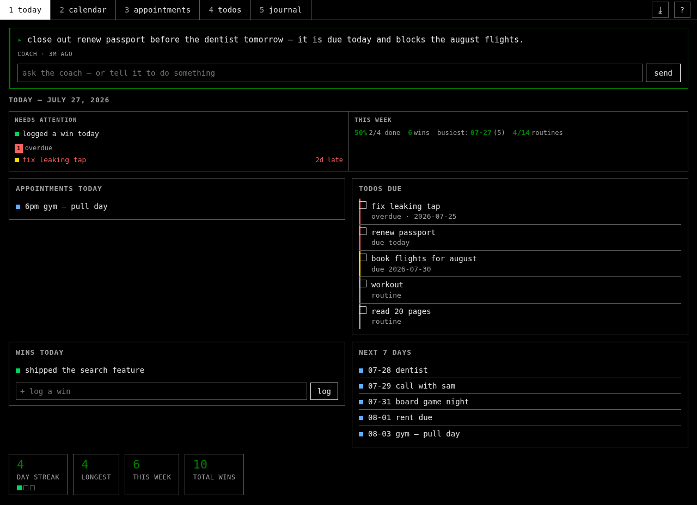
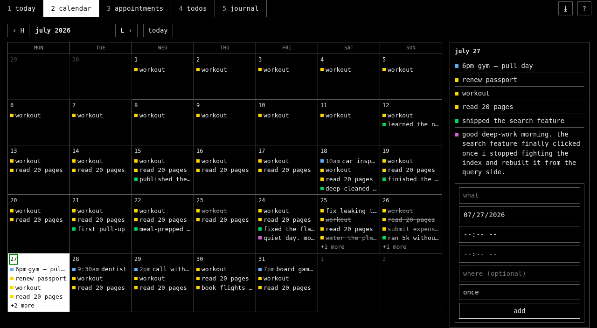
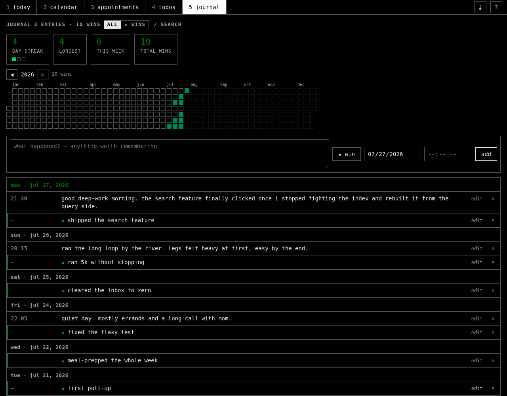

# lifeplanner

a local, private life dashboard — **calendar · appointments · todos · wins · journal** — that an
llm can read and write too. one set of plain json files on your disk, two doors into them: a
vanilla web ui for you, and an [mcp](https://modelcontextprotocol.io) server for an assistant
like claude. no accounts, no cloud, no tracking. your data never leaves your machine.







- **stdlib-only web app** — python 3.8+, no dependencies. clone and run.
- **square, terminal-styled ui** — light + dark, eight accent colors, keyboard-first (vim keys).
- **routines** — todos can repeat (daily/weekly); a routine like "workout" shows every day and is ticked off per-day, so it's back tomorrow.
- **one life-log** — diary entries and wins share a single timeline, with a contribution heatmap and
  an honest arcade streak. log many entries a day, backdate a memory, and a nightly nudge reminds you
  to write. private — never leaves your disk, never touches the calendar feed.
- **works on your phone** — installable PWA over your private network; optional `.ics` / caldav export if you'd rather see appointments in a native calendar app.
- **mcp server** — let an assistant log your wins, add todos, flag what's slipping, and review your week (one optional dep).
- **a coach, if you want one** — a next-move line at the top of today, and a chat box whose answers
  can *act* on your planner (reschedule, log, add) through the same mcp tools — never delete.
- **it reaches out** — optional push that nudges you: a daily standup + weekly review, with overdue
  alerts that escalate the longer you ignore them. as phone *and* desktop notifications, tap-to-open.
  and if a day ends unwritten, it backfills the diary with a terse factual digest — no holes.
- **crash-safe storage** — atomic writes, cross-process lock, corrupt-file-safe.

## quick start

```sh
git clone https://github.com/mellen9999/lifeplanner.git && cd lifeplanner
./launch.sh            # or: python3 app.pyw
```

opens `http://127.0.0.1:8765`. bound to localhost only — nothing is exposed to your network.
launching again just focuses the running window (only one server runs at a time).

no build step, no `npm`, no dependencies for the app itself.

## how to use it

five sections (number keys switch them):

1. **today** — your daily glance, kept lean on purpose. the **coach line** (if set) sits at the very
   top — one next move, stamped with its age. then what's **left** today (a timed appointment drops
   off once it's over), tomorrow's appointments, and today's wins with a one-field win logger. todos
   live on their own tab. open this first each day.
2. **calendar** — month grid; click a day to see what's on it and add an appointment with the **full
   controls right there** (time, place, repeat, end-date) — no jumping to another page. colored
   marks: green = a win, blue = an appointment, yellow = a due todo, violet = a diary entry.
3. **appointments** — your agenda. add with a date (+ optional time) and place; set **repeat** (daily
   / weekly / every-other-week / monthly, with an optional end date) to make it recur. the list is
   grouped **upcoming** (soonest first, recurring series resolved to their next occurrence) and
   **past** — the calendar marks every occurrence and your phone gets it as a standard repeating event.
   a spammy series (say, a daily alarm synced in from the phone) can be **muted** (`m`): it disappears
   from the calendar, today, reminders and the `.ics` feed without being deleted — `M` shows the
   hidden pile, and a caldav server copy is never touched.
4. **todos** — things to do; give one a due date and it becomes a reminder on the calendar + phone.
   each todo carries a **colour by deadline pressure**: red = due today / overdue, yellow = due soon
   (within ~3 days), calm green = plenty of time or no date — so the most urgent thing is obvious at a
   glance, and the top of the list is literally what to do next. **today** shows only what's actionable
   now (a far-future deadline stays parked off today until it nears); the **todos page** shows everything,
   urgency-sorted. set **repeat** to make a todo a daily/weekly **routine** (eat lunch, workout, meds) — it
   shows up every day in "todos due", ticked off per-day so it's back tomorrow; routines never count as
   "overdue" (a missed day is just a day).
5. **journal** — the life-log: **diary entries and wins on one timeline**, newest day first. write
   what happened in a free-text entry stamped to the moment (log as many as you like a day), or flip
   the **★ win** toggle to log it as a win; filter the stream to **all** or **wins only**, and search
   it. set a date to **backdate a memory** (something from last week, or years ago). up top, a
   **contribution heatmap** + an honest, arcade-style streak: each day with a win extends it and every
   7th banks a **shield** (max 3); a missed day spends a shield to keep the run alive, but miss with
   no shields left and the streak resets to 0 — the shields are shown so the grace is never hidden.
   entries never go on the calendar feed or your phone; they're yours to look back on. a **nightly
   nudge** ("what happened today?") reminds you to write, and stays quiet on days you already have.

every item can be edited in place (`e` or double-click) or deleted (`×` / `d d`, undo with `u`).
nothing needs saving — it's written to disk the moment you add it.

## keys

| keys | action | | keys | action |
|---|---|---|---|---|
| `1` … `5` | switch section | | `h` `j` `k` `l` | calendar: move day in grid |
| `n` | new item | | `H` / `L` | calendar: jump month |
| `c` | talk to the coach | | `e` / dbl-click | edit selected |
| `j` / `k` | move selection (lists) | | `enter` | save edit / open day |
| `x` | toggle todo done | | `d` `d` | delete selected |
| `X` | todos: show / hide done | | `u` | undo last delete |
| `m` / `M` | mute appointment · hidden pile | | `/` | filter the current list |
| `t` · `r` · `?` | theme · refresh · help | | `esc` | cancel / close |

theme and accent are saved with your data.

## let an assistant in (optional mcp)

```sh
./install.sh           # linux/mac — or install.bat on windows
```

it creates `.venv`, installs the optional deps from `requirements.txt` (the mcp sdk + caldav
extras), and prints a ready `claude mcp add …` line (the windows script prints the
`\.venv\Scripts\python.exe` path). run it, restart claude, and check `/mcp`. the assistant
then has these tools, all writing to the same local files the web app reads:

partner: `whats_slipping` (what needs attention now) · `review_period` (how the last N days went) ·
`get_stats`
read: `get_overview` · `get_day` · `get_week` · `get_range` · `list_achievements` ·
`list_todos` · `list_appointments` · `list_journal`
write: `add_achievement` · `add_todo` · `complete_todo` · `add_appointment` · `add_journal` ·
`update_achievement` · `update_todo` · `update_appointment` · `update_journal` · `delete_item`

(wins are stored as the `achievements` entity — same thing, older name.) writes from the assistant
appear in your open ui within a few seconds; your edits are visible to it immediately. (works with
any mcp client — claude desktop, claude code, etc.)

## the coach (optional)

two pieces, both optional, both riding the same local files:

- **the directive** — one next-move line at the top of today, shown with its age so stale advice
  looks stale. anything can write it — a script on a timer, typically an llm that read
  `whats_slipping` first: `python3 -c "import store; store.set_coach('close out the passport — it
  blocks the flights')"`. writing the same line twice is a no-op, so a timer never causes churn.
- **the chat** — the coach box on today (`c` focuses it; enter sends, shift+enter newlines — dump
  whole paragraphs at it). your message runs the
  [claude cli](https://claude.com/claude-code) headless with **only lifeplanner's
  mcp tools** — no shell, no file access, and no `delete_item` — so "push the dentist to thursday
  and log the win" actually edits your planner, and the worst it can ever do is add or reschedule.
  the coach **remembers**: every turn is kept (your message is saved before claude even runs), the
  transcript follows you across devices, and a `remember` tool lets it keep durable facts about you
  that feed every future prompt. needs the mcp install (above) plus the `claude` cli on the machine
  running the app. tune with `LIFEPLANNER_COACH_TIMEOUT` / `LIFEPLANNER_CLAUDE_BIN`.

with no directive set the line simply isn't there; with no `claude` cli a chat just answers
"coach unavailable" — nothing else in the app depends on either.

## run it as a service (optional)

to keep it always reachable (for your phone, below), run the web app under your init system
instead of a terminal. a systemd **user** unit — pair it with `loginctl enable-linger $USER` so it
keeps running after you log out:

```ini
# ~/.config/systemd/user/lifeplanner.service
[Unit]
Description=lifeplanner web app
[Service]
WorkingDirectory=%h/projects/lifeplanner
ExecStart=/usr/bin/python3 %h/projects/lifeplanner/app.pyw
Environment=LIFEPLANNER_HOST=0.0.0.0
Environment=LIFEPLANNER_NO_BROWSER=1
Restart=on-failure
[Install]
WantedBy=default.target
```

`systemctl --user enable --now lifeplanner`. set `LIFEPLANNER_HOST` to your LAN/tailnet address (or
`0.0.0.0`) so the phone can reach it — keep it on a **private** network, never the public internet.

> **trust boundary, once it leaves localhost.** the token only blocks *cross-origin* web
> attacks — it does **not** stop a same-network device, which can load the page and read the token
> straight from it. so everyone on the network effectively has full access. on a **tailnet** that's
> fine (every device is individually authenticated — that's the recommended setup). on a **shared
> LAN** (guest wifi, an office) it is not — put it behind a reverse proxy with HTTP Basic auth, or
> stick to tailscale.

to update later: `git pull` then `systemctl --user restart lifeplanner`. want it hands-off? add a
5-minute `.timer` that runs `git pull --ff-only` in the clone and restarts on change — then a push
deploys itself.

## use it from your phone

the simplest way — no second calendar, nothing to sync: run lifeplanner on
a machine that's reachable, and open it in your phone's browser over your **private
network** (a LAN, or a mesh vpn like [tailscale](https://tailscale.com)). it's the same
app — an appointment you add on your phone goes straight into the one store and shows up
on your desktop instantly. it's an installable PWA — "add to home screen" and it opens full-screen
with its own icon, like a native app. keep it private: a LAN or tailnet, never the public internet.

**most people stop here** — the installed PWA is your calendar on the phone, and the nudges (below)
push what matters. the two options below only matter if you want lifeplanner's appointments to show up
**inside another calendar app you already live in** (a work/shared/family calendar you don't control).
if the app itself is your calendar, skip them.

## phone calendar (one-way, read-only)

appointments and due-dated todos are written to `data/lifeplanner.ics` on every change. to see them
on your phone:

1. sync the file to your phone (e.g. [syncthing](https://syncthing.net)), or set `ics_sync_path`
   in `data/settings.json` to a synced folder.
2. install a calendar-subscription app — [ICSx5](https://icsx5.bitfire.at) (foss) on android.
3. subscribe to the synced `lifeplanner.ics`. it refreshes on a schedule.

read-only by design: you edit in the app, the phone just shows it. no always-on server, no network
exposure, survives reboots.

## two-way phone sync (optional, self-hosted)

want appointments you create on your phone to show up here too (and vice versa)? back the
**appointments** entity with a [caldav](https://en.wikipedia.org/wiki/CalDAV) server instead of local
json. todos, wins and the journal stay local — only appointments sync.

1. run a caldav server you control — [radicale](https://radicale.org) is tiny and foss. create a
   collection (calendar) and a user/password.
2. `pip install icalendar defusedxml` (already there if you ran `./install.sh` — they're in
   `requirements.txt`).
3. copy `.caldav.json.example` to `.caldav.json` and fill in your server url, user, password. it's
   gitignored — your credentials never get committed.
4. restart the app. appointments now live on your server; on your phone, point a caldav client
   ([DAVx5](https://www.davx5.com), foss) at the same collection.

it's a single source of truth — no two-store merge — so a change on either side appears on the other.
the desktop keeps a local cache and tells you (a banner) when the server is unreachable, rather than
silently showing stale data. with no `.caldav.json`, appointments stay local json and none of this
applies — the zero-infra default is unchanged.

> keep the server private (a LAN or a mesh vpn like [tailscale](https://tailscale.com)); don't expose
> caldav to the public internet.

## reminders (optional)

get a notification **1 day and 1 hour before** each appointment, pushed from wherever lifeplanner
runs — no calendar app, no background-sync fragility. it uses [ntfy](https://ntfy.sh) (foss push,
self-hostable so your data stays private).

1. run an ntfy server (or use ntfy.sh) and pick a hard-to-guess topic.
2. on a timer, run `reminders.py` with:
   ```sh
   LIFEPLANNER_NTFY_SERVER=http://your-ntfy:2587 \
   LIFEPLANNER_NTFY_TOPIC=your-secret-topic \
   LIFEPLANNER_REMINDERS=1440,60 \
   python3 reminders.py
   ```
   (a systemd `.timer` every 5 min is ideal; offsets are minutes-before for timed appointments —
   all-day ones get an evening-before + morning-of nudge.)
3. install the ntfy app and subscribe to the same server + topic.

it's stateful (each reminder fires once) and does nothing without the env vars, so it's fully optional.

## nudges — the forcing function (optional)

a planner you have to remember to open is just a todo list. `nudge.py` reaches out instead: a
**daily standup** ("2 overdue · 3d since a win"), a **weekly review**, and a **nightly journal
prompt** ("what happened today?") pushed to your phone, with overdue alerts that **escalate** the
longer you ignore them — 1-2 days normal, 3-6 high priority, **7+ days urgent (bypasses
do-not-disturb, your phone rings).** ignoring becomes expensive.

it rides the same ntfy setup as reminders. run it on a timer (every ~15 min):

```sh
LIFEPLANNER_NTFY_SERVER=http://your-ntfy:2587 \
LIFEPLANNER_NTFY_TOPIC=your-secret-topic \
LIFEPLANNER_URL=http://your-host:8765 \
python3 nudge.py
```

it only pushes when something's actually slipping (no nagging on a clean day), fires each nudge at
most once per day / per week, and does nothing without the env vars — fully optional. tune the timing
with `LIFEPLANNER_STANDUP_HOUR` (default 8), `LIFEPLANNER_REVIEW_DOW` (mon=0, default 6=sun),
`LIFEPLANNER_REVIEW_HOUR` (default 18), `LIFEPLANNER_JOURNAL_HOUR` (default 21, the nightly diary
prompt — skipped on days you've already written); set `LIFEPLANNER_NUDGE=off` to silence it.

it also keeps the diary gapless: if a day ends with nothing written, after
`LIFEPLANNER_AUTOJOURNAL_HOUR` (default 23) it backfills a terse **factual digest entry** — prefixed
"auto log" so it's never mistaken for your own words — from what actually happened (appointments
kept, todos done, routines hit, wins logged). a genuinely empty day gets nothing (no fabricated
entries), and deleting an auto entry stays deleted. set `LIFEPLANNER_AUTOJOURNAL=off` to keep the
diary purely handwritten.

set `LIFEPLANNER_URL` (your app's address) and **tapping a notification opens lifeplanner**. ntfy
isn't just phones — subscribe to the same server + topic from the [ntfy web app or desktop client](https://docs.ntfy.sh/subscribe/phone/)
and the nudges arrive as **desktop notifications** too (handy if you live at a computer). a minimal
always-on bridge is just `ntfy subscribe <server>/<topic> 'notify-send "$title" "$message"'` under a
user service.

## configuration

all optional, via environment variables:

| var | default | purpose |
|---|---|---|
| `LIFEPLANNER_HOST` | `127.0.0.1` | bind address (keep localhost unless you know why) |
| `LIFEPLANNER_PORT` | `8765` | http port |
| `LIFEPLANNER_DATA` | `./data` | where your json + `.ics` live (point at a synced/XDG dir) |
| `LIFEPLANNER_NO_BROWSER` | unset | set to `1` to never auto-open a browser (e.g. when run as a service) |
| `LIFEPLANNER_NTFY_SERVER` · `_TOPIC` | unset | ntfy server + topic for reminders/nudges (both required to push) |
| `LIFEPLANNER_URL` | unset | your app's address; makes notifications tap-to-open |
| `LIFEPLANNER_REMINDERS` | `1440,60` | reminder offsets in minutes before a timed appointment |
| `LIFEPLANNER_STANDUP_HOUR` | `8` | hour the daily standup nudge may fire |
| `LIFEPLANNER_REVIEW_DOW` · `_HOUR` | `6` · `18` | weekly review day (mon=0) + hour |
| `LIFEPLANNER_JOURNAL_HOUR` | `21` | hour the nightly "write your diary" prompt may fire |
| `LIFEPLANNER_AUTOJOURNAL` · `_HOUR` | on · `23` | auto-diary digest for unwritten days: `off` to disable, hour after which it writes |
| `LIFEPLANNER_NUDGE` | unset | set to `off` to disable nudges entirely |
| `LIFEPLANNER_NTFY_ALARM_TOPIC` | unset | separate ntfy topic for appointment reminders (defaults to the main topic) |
| `LIFEPLANNER_COACH_TIMEOUT` | `150` | max seconds a coach chat turn may run |
| `LIFEPLANNER_CLAUDE_BIN` | `claude` | path to the claude cli the coach chat runs |
| `LIFEPLANNER_CALDAV` | unset | set to `off` to force local-only appointments (ignore `.caldav.json`) |
| `LIFEPLANNER_BACKUP_HOST` · `_DIR` · `_KEEP` | unset | `backup.sh` target ssh host · remote dir (`backups/lifeplanner`) · tarballs kept (`14`) |

## layout

```
app.pyw          web server + rest api (stdlib only)
store.py         shared data layer — atomic writes, file lock, .ics generation
mcp_server.py    mcp server (assistant's door; needs the mcp sdk)
coach_chat.py    coach chat backend — runs the claude cli with planner-only tools
caldav_store.py  optional caldav backend for two-way phone sync (needs icalendar/defusedxml)
reminders.py     optional ntfy push reminders (run on a timer)
nudge.py         optional standup / review / journal pushes + the auto-diary digest
notify.py        shared ntfy push helper (reminders + nudge publish through it)
review.py        planning-partner derivations (what's slipping / how a period went)
backup.sh        optional daily off-machine backup of data/ over ssh (run on a timer)
web/             ui — vanilla html / css / js
tests/           test suite (python3 -m unittest discover -s tests)
requirements.txt optional deps only — the app itself needs none
launch.sh        linux/mac launcher        launch.bat   windows launcher
install.sh       optional mcp setup        install.bat  windows mcp setup
data/            your data (created on first run, gitignored — never committed)
```

## data + safety

plain json in `data/`. back it up with the **⤓ export** button (downloads the whole vault as a
dated zip), just copy the folder, or put `backup.sh` on a daily timer — set
`LIFEPLANNER_BACKUP_HOST` to an ssh host and it tarballs `data/` there daily, keeping the last 14
(`_DIR` / `_KEEP` to tune). restore by unzipping (or untarring) back into
`data/`. files fail safe to empty rather than crashing, writes are atomic (temp + rename), and the
ui and assistant are serialized by a lockfile so concurrent writes can't corrupt anything. your data
dir is gitignored — it will never end up in a commit.

## tests

```sh
python3 -m unittest discover -s tests -v
```

## license

[MIT](LICENSE).
